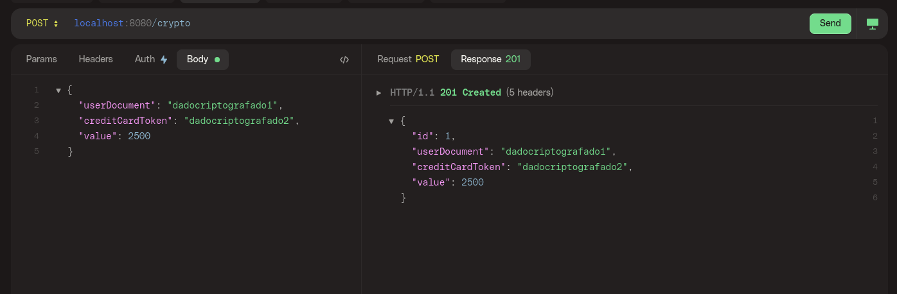

# Crypto studies
Criptografia - proposta de estudo feita no repositório [Back-end Brasil](https://github.com/backend-br).

Projeto simples com o objetivo de estudo com criptografia.
- Criptografia de atributos sensíveis de uma entidade. 
- Criptografia somente no banco de dados.
- Dados que a api retorna são descriptografados.

  Mais detalhes da [proposta](https://github.com/backend-br/desafios/blob/master/cryptography/PROBLEM.md).

## Techs:
  - Java 17
  - Spring Boot
  - JPA/Hibernate
  - Flyway
  - MySql
  - AES (Advanced Encryption Standard)
    

### POST / crypto
Criando uma transação

### GET / crypto
Listando todas as transações

### GET / crypto/id
Listando transação específica

### DB / SELECT
DB com os dados criptografados

